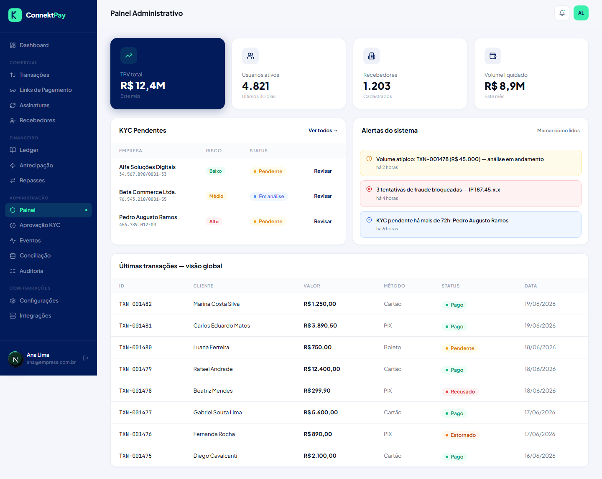

# Módulo: Admin

## Objetivo

Reunir rotinas administrativas e operacionais: revisão de KYC, acompanhamento de eventos, conciliação e auditoria.

## O que faz

- Painel administrativo com visão de operação
- Aprovação de KYC (documentos)
- Monitoramento de eventos e reprocessamento quando necessário
- Conciliação e tratamento de divergências
- Auditoria de ações na plataforma
- Status/configuração do provedor financeiro (quando aplicável)

## Como utilizar (passo a passo)

1. Acesse **Admin**
2. Escolha a rotina conforme o objetivo:
   - **Aprovação KYC** para revisar documentos
   - **Eventos** para acompanhar e reprocessar
   - **Conciliação** para validar divergências
   - **Auditoria** para rastrear ações

## Fluxo (como o usuário usa)

- Operação diária → revisar KYC e eventos → tratar divergências → consultar auditoria quando houver questionamentos

## Permissões

- Owner: permitido (todas as rotinas)
- Admin: permitido (rotinas operacionais e administrativas)
- Financeiro: permitido apenas em **Conciliação**

## Observações

- O item “Provedor Financeiro” é restrito ao Owner.

