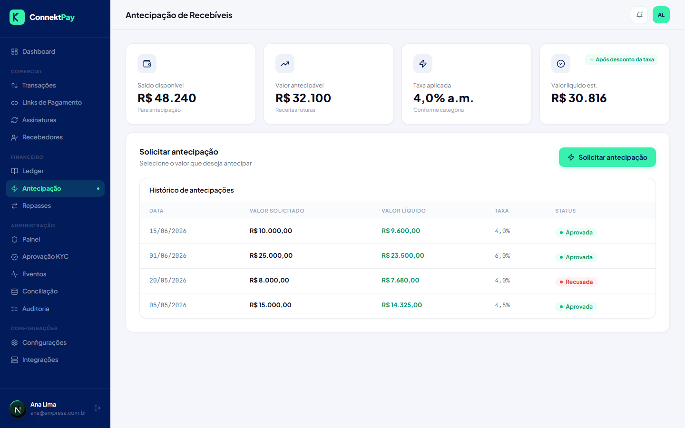

# Módulo: Antecipação

## Objetivo

Permitir que o financeiro simule e solicite antecipação de recebíveis (quando disponível).

## O que faz

- Mostra visão de antecipações
- Permite simular valores e taxas (conforme regras disponíveis)
- Permite acompanhar solicitações e status

## Como utilizar (passo a passo)

1. Acesse **Antecipação**
2. Faça a simulação (quando disponível)
3. Registre a solicitação e acompanhe o status

## Fluxo (como o usuário usa)

- Identificar necessidade de caixa → simular → solicitar → acompanhar aprovação/liquidação

## Permissões

- Owner: permitido
- Admin: bloqueado
- Financeiro: permitido

## Observações

- A execução real e regras finais de antecipação dependem da integração completa com o provedor financeiro.

