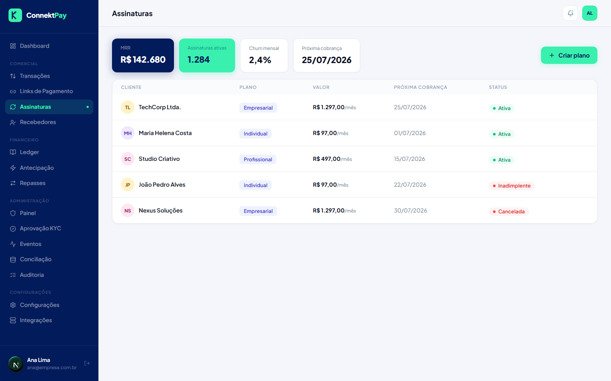

# Módulo: Assinaturas

## Objetivo

Gerenciar cobranças recorrentes (assinaturas) para clientes.

## O que faz

- Lista assinaturas e seus status
- Permite acompanhar evolução ao longo do tempo
- Permite acesso ao detalhe de cada assinatura

## Como utilizar (passo a passo)

1. Acesse **Assinaturas**
2. Filtre/ache a assinatura desejada
3. Abra o detalhe para ver status, eventos e informações relacionadas

## Fluxo (como o usuário usa)

- Criar plano → criar assinatura → acompanhar pagamentos recorrentes → cancelar/ajustar quando necessário

## Permissões

- Owner: permitido
- Admin: permitido
- Financeiro: permitido (visão e acompanhamento)

## Observações

- A execução “real” das cobranças e eventos do provedor fazem parte da próxima fase.

