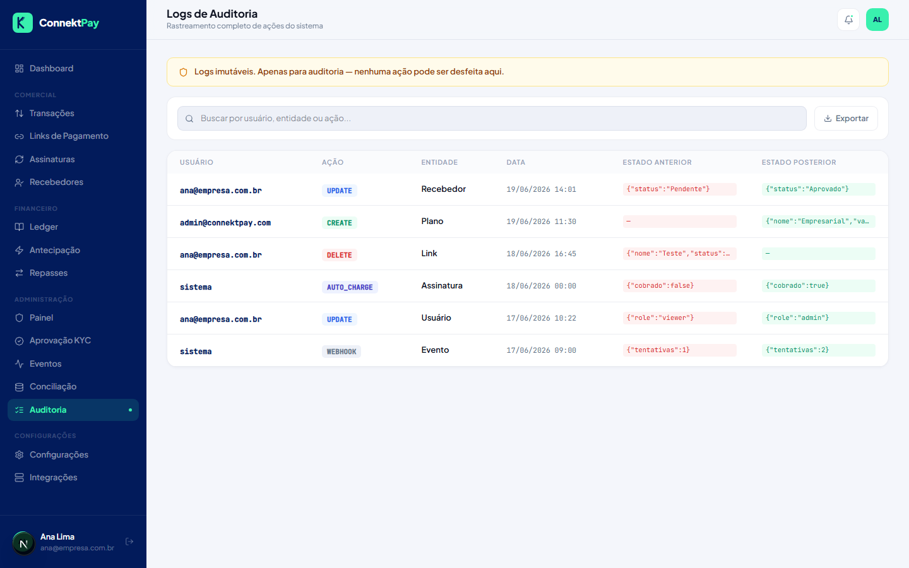

# Módulo: Auditoria

## Objetivo

Registrar e consultar ações importantes realizadas na plataforma, apoiando governança e rastreabilidade.

## O que faz

- Lista logs de ações e eventos relevantes
- Permite investigar “quem fez o quê e quando”

## Como utilizar (passo a passo)

1. Acesse **Admin → Auditoria**
2. Filtre por período/ações quando disponível
3. Use os detalhes para entender o histórico de uma operação

## Fluxo (como o usuário usa)

- Encontrou uma divergência → consulta auditoria → identifica origem → corrige processo

## Permissões

- Owner: permitido
- Admin: permitido
- Financeiro: bloqueado

## Observações

- Auditoria é especialmente útil ao validar permissões e rotinas financeiras.

