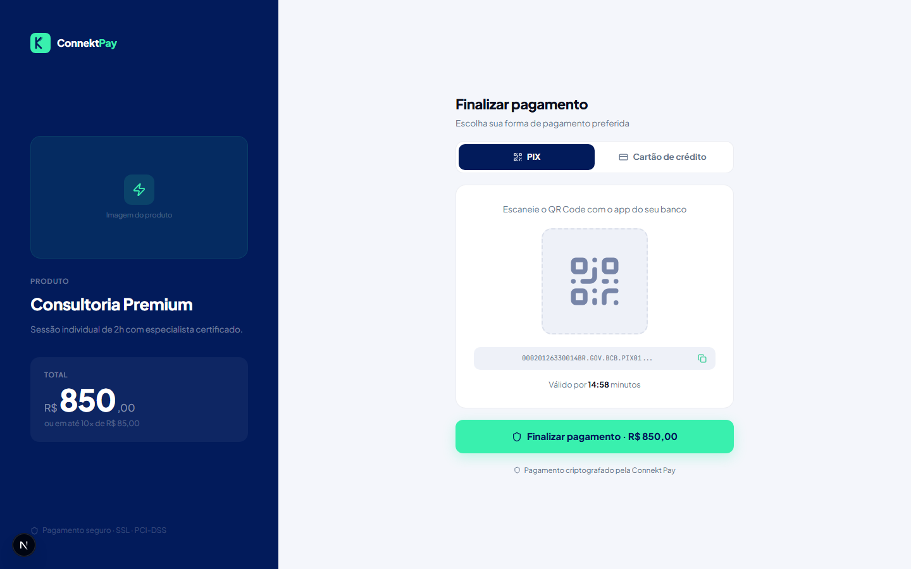

# Módulo: Checkout

## Objetivo

Oferecer uma experiência simples para o cliente final pagar uma cobrança gerada pela Connekt Pay.

## O que faz

- Exibe a página pública de pagamento (checkout)
- Permite selecionar método de pagamento (dependendo de configuração do provedor)
- Direciona para a confirmação pós-pagamento quando aplicável

## Como utilizar (passo a passo)

1. Gere um link de pagamento no módulo **Links de Pagamento**
2. Abra o link como cliente (em aba anônima ou compartilhando com outra pessoa)
3. Escolha o método e siga as instruções do checkout

## Fluxo (como o usuário usa)

- Operação cria o link → cliente paga no checkout → operação confirma no painel

## Permissões

- Checkout é público (cliente final não precisa de login)

## Observações

- Pagamentos reais (PIX/cartão) e atualização de status em tempo real fazem parte da próxima fase (integração completa com o provedor financeiro).

