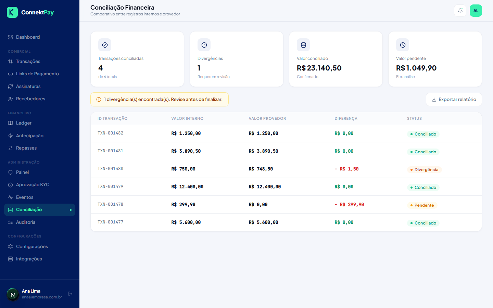

# Módulo: Conciliação

## Objetivo

Conferir se os valores e status do painel estão coerentes com o que deve ser recebido, identificando divergências e suportando ações corretivas.

## O que faz

- Permite executar rotinas de conciliação
- Exibe divergências para análise e tratamento

## Como utilizar (passo a passo)

1. Acesse **Admin → Conciliação**
2. Execute a conciliação (quando disponível)
3. Revise divergências e tome ações conforme o caso

## Fluxo (como o usuário usa)

- Rodar conciliação → identificar divergência → validar origem → corrigir processo/registro quando necessário

## Permissões

- Owner: permitido
- Admin: permitido
- Financeiro: permitido

## Observações

- Conciliação completa com dados do provedor faz parte da próxima fase.

