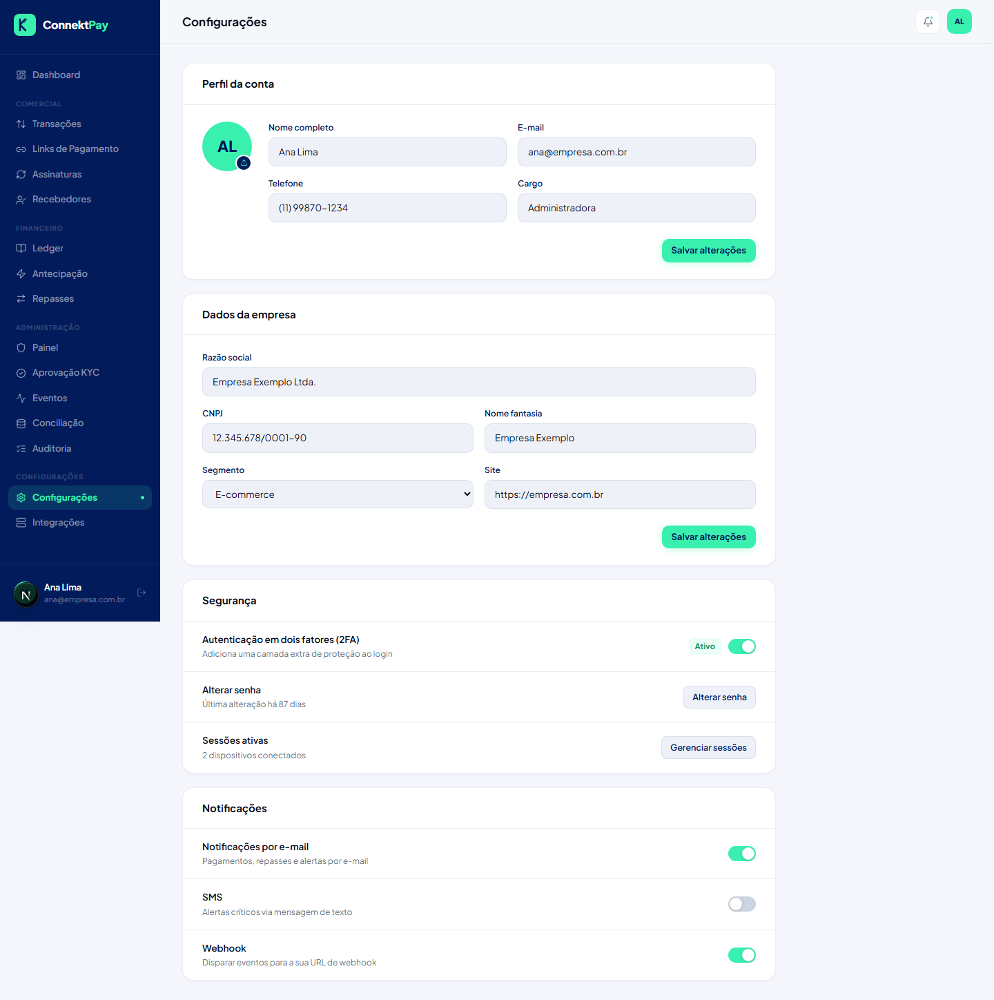

# Módulo: Configurações

## Objetivo

Centralizar configurações da conta/organização e parâmetros operacionais da plataforma.

## O que faz

- Permite acessar páginas de configurações
- Centraliza itens que afetam operação e integração

## Como utilizar (passo a passo)

1. Acesse **Configurações**
2. Revise informações e parâmetros disponíveis
3. Ajuste apenas quando houver clareza do impacto operacional

## Fluxo (como o usuário usa)

- Necessidade de ajuste → revisar configurações → aplicar mudança → validar efeito no painel

## Permissões

- Owner: permitido
- Admin: bloqueado
- Financeiro: bloqueado

## Observações

- Integrações ficam na seção “Integrações”.

