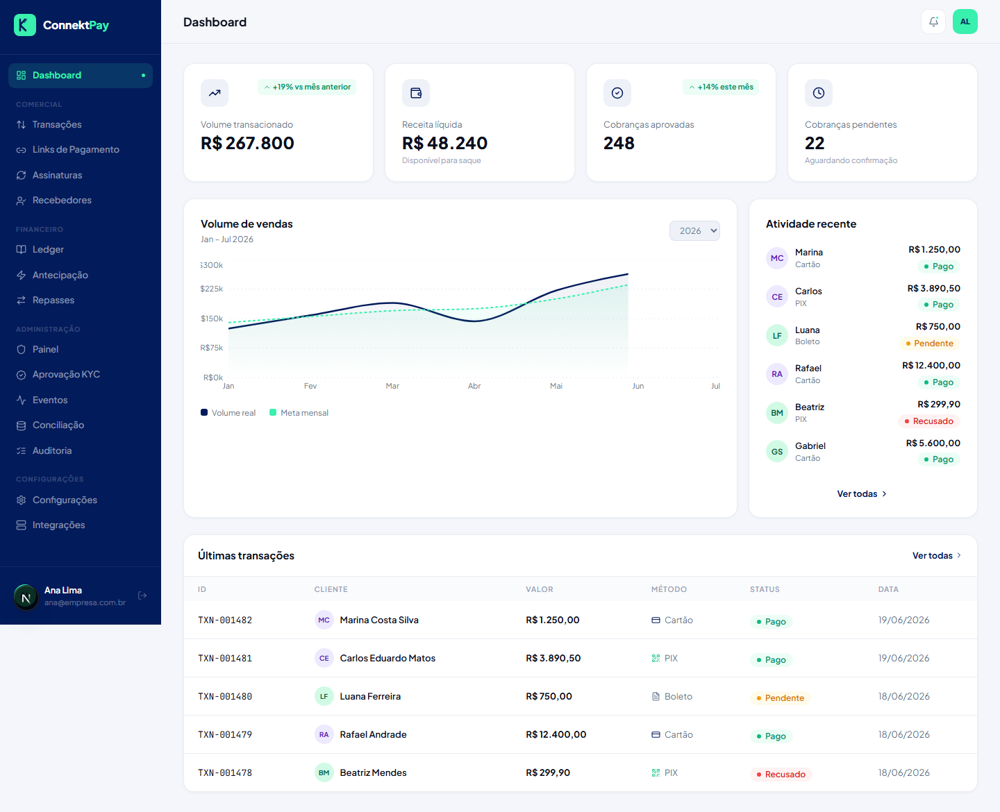

# Módulo: Dashboard

## Objetivo

Dar uma visão rápida do negócio: volume de transações, status, desempenho e indicadores principais.

## O que faz

- Exibe métricas e KPIs do período selecionado
- Ajuda a identificar rapidamente variações (ex.: queda de aprovações, aumento de pendências)

## Como utilizar (passo a passo)

1. Acesse **Dashboard** no menu lateral
2. Ajuste filtros/intervalo quando disponível
3. Use os atalhos para navegar para listas (ex.: Transações)

## Fluxo (como o usuário usa)

- Abrir o dia no Dashboard → identificar alertas/pendências → agir no módulo correspondente

## Permissões

- Owner: permitido
- Admin: permitido
- Financeiro: permitido

## Observações

- Indicadores podem variar conforme volume/dados do ambiente.

