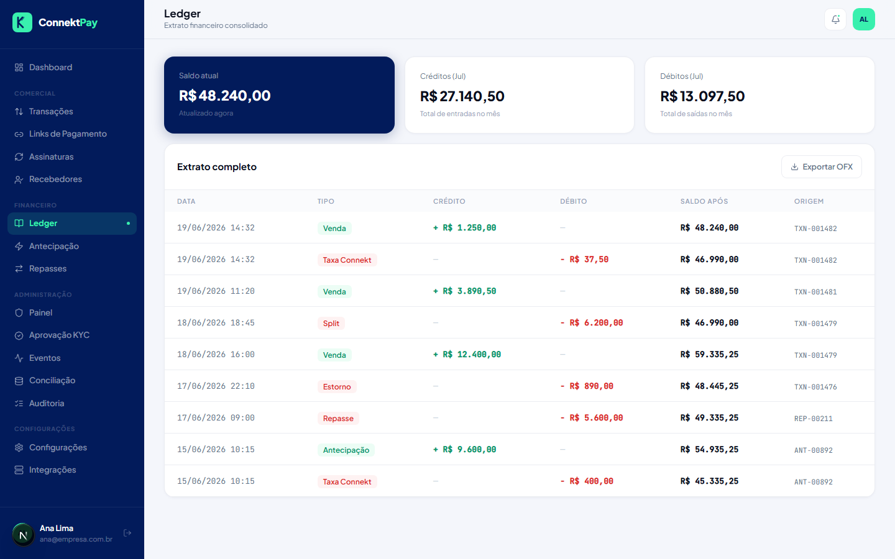

# Módulo: Ledger

## Objetivo

Dar visibilidade financeira com um extrato interno (movimentações e saldo), apoiando controle e auditoria.

## O que faz

- Exibe lançamentos financeiros e saldo
- Ajuda a entender entradas/saídas e a origem das movimentações

## Como utilizar (passo a passo)

1. Acesse **Ledger**
2. Revise os lançamentos e use filtros quando disponíveis
3. Concilie divergências com o módulo de **Conciliação** quando necessário

## Fluxo (como o usuário usa)

- Consultar saldo → validar lançamentos → investigar divergências → registrar ações necessárias

## Permissões

- Owner: permitido
- Admin: bloqueado
- Financeiro: permitido

## Observações

- Em ambientes com poucos dados, o estado “Nenhum lançamento encontrado” é esperado.

