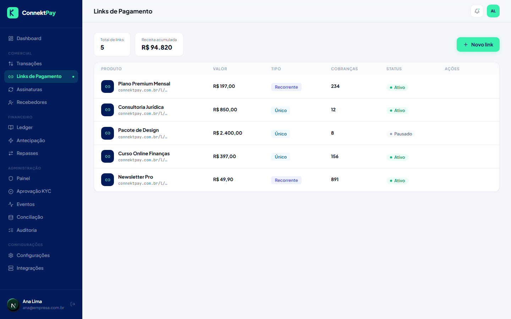
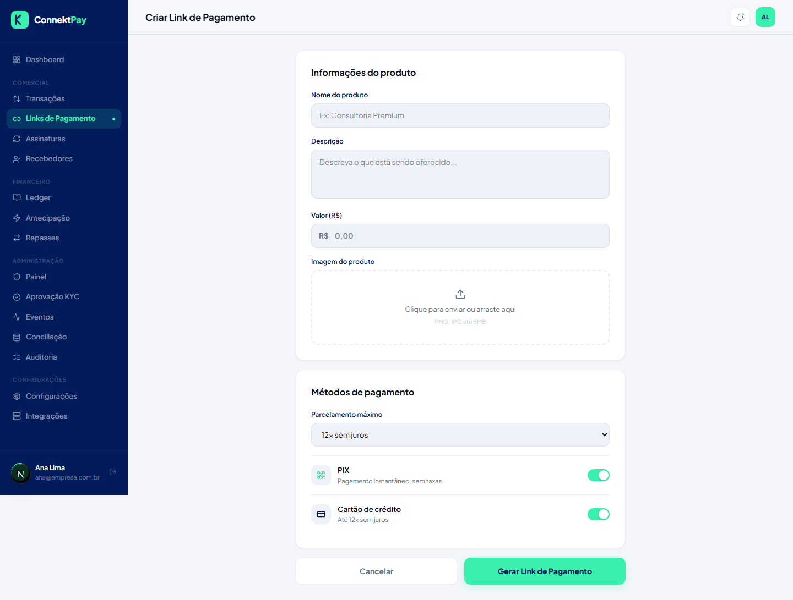

# Módulo: Links de Pagamento

## Objetivo

Criar links para cobrar clientes sem precisar de integração direta do cliente com a plataforma.

## O que faz

- Cria links com nome, valor (ou regras) e configurações de cobrança
- Permite compartilhar o link do checkout com o cliente
- Permite acompanhar o uso do link (via transações geradas)

## Como utilizar (passo a passo)

1. Acesse **Links de Pagamento**
2. Clique em **Novo Link**
3. Preencha as informações do link e salve
4. Copie o link e compartilhe com o cliente

## Fluxo (como o usuário usa)

- Criar link → enviar ao cliente → acompanhar status em Transações → confirmar pagamento

## Permissões

- Owner: permitido
- Admin: permitido
- Financeiro: bloqueado

## Observações

- A confirmação de pagamento em tempo real depende da integração completa com o provedor financeiro.

