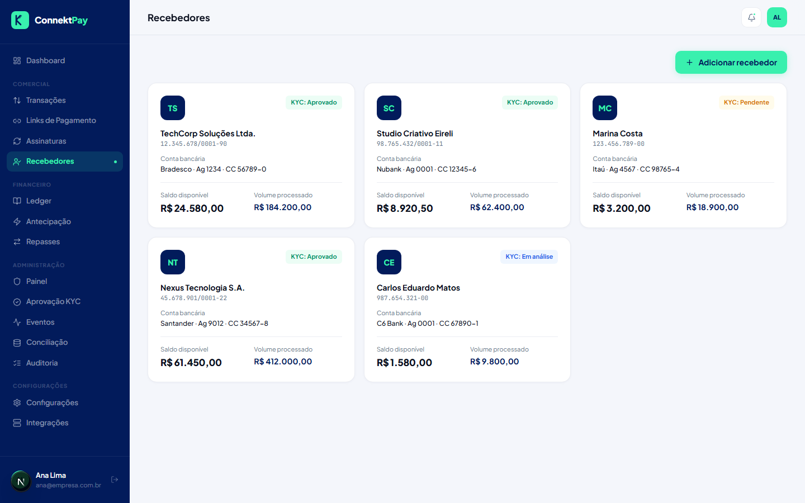

# Módulo: Recebedores

## Objetivo

Cadastrar e gerenciar recebedores (quem vai receber os valores) e seus dados necessários para operação.

## O que faz

- Lista recebedores
- Permite cadastrar/editar informações
- Suporta o acompanhamento do status de KYC quando aplicável

## Como utilizar (passo a passo)

1. Acesse **Recebedores**
2. Cadastre um novo recebedor com dados básicos
3. Acompanhe a situação de validação (KYC) quando necessário

## Fluxo (como o usuário usa)

- Cadastrar recebedor → anexar/validar KYC (quando aplicável) → habilitar operação financeira

## Permissões

- Owner: permitido
- Admin: permitido
- Financeiro: bloqueado

## Observações

- A validação automática via provedor financeiro é parte da próxima fase (quando aplicável).

