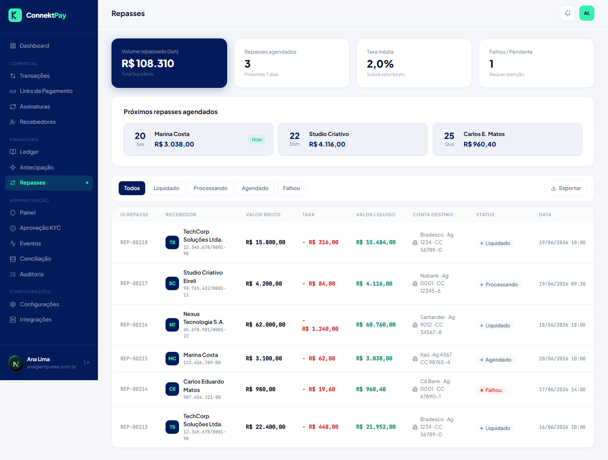

# Módulo: Repasses

## Objetivo

Visualizar e operar rotinas de repasse/payout, garantindo controle financeiro e rastreabilidade.

## O que faz

- Lista repasses e seus status
- Ajuda a acompanhar a evolução de pagamentos para recebedores

## Como utilizar (passo a passo)

1. Acesse **Repasses**
2. Consulte a lista e filtre por status quando disponível
3. Use a conciliação para investigar divergências (quando aplicável)

## Fluxo (como o usuário usa)

- Acompanhar repasses → validar status → conciliar divergências → registrar ações necessárias

## Permissões

- Owner: permitido
- Admin: bloqueado
- Financeiro: permitido

## Observações

- A execução real e o status final dependem da integração completa com o provedor financeiro.

