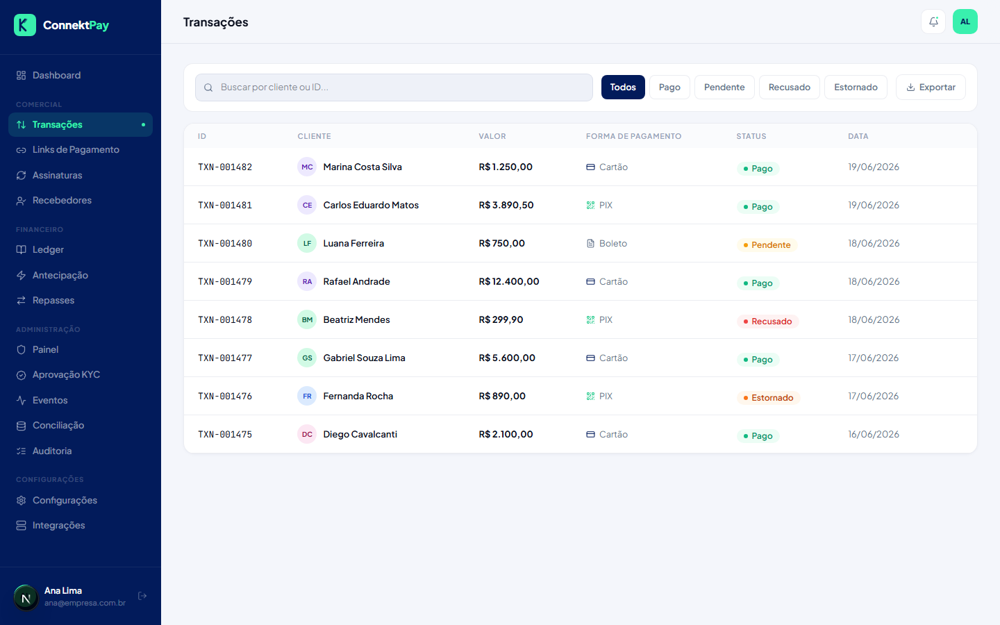

# Módulo: Transações

## Objetivo

Acompanhar todas as transações da organização, com filtros e consulta rápida.

## O que faz

- Lista transações por data e status
- Permite filtrar por status e buscar por identificadores
- Permite exportar para análise (quando disponível)

## Como utilizar (passo a passo)

1. Acesse **Transações**
2. Use filtros de status e busca para localizar uma transação
3. Abra detalhes quando necessário (ex.: referência do provedor, data e valor)

## Fluxo (como o usuário usa)

- Recebe uma dúvida do cliente → busca a transação → confirma status → orienta o cliente

## Permissões

- Owner: permitido
- Admin: permitido
- Financeiro: permitido

## Observações

- Em ambientes com poucos dados, a tela pode ficar em estado “vazio” (isso é esperado).

