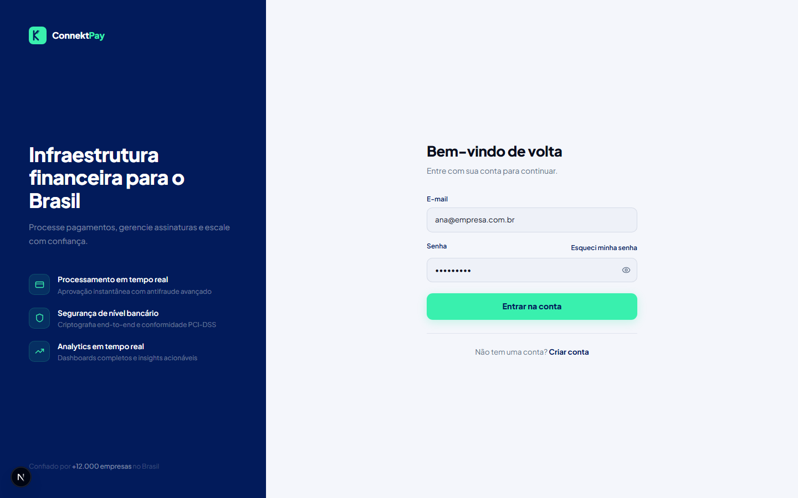
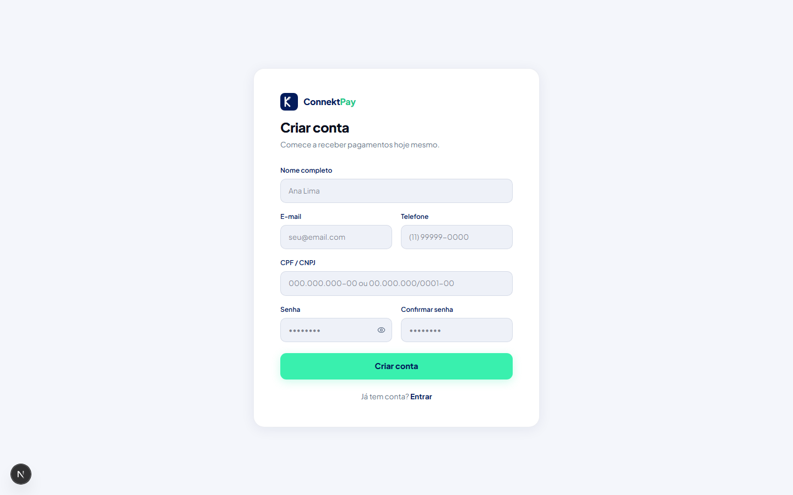
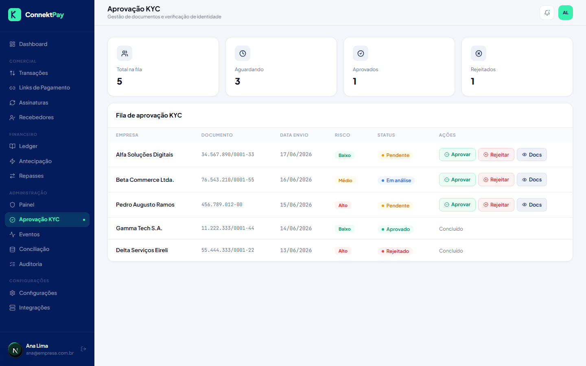
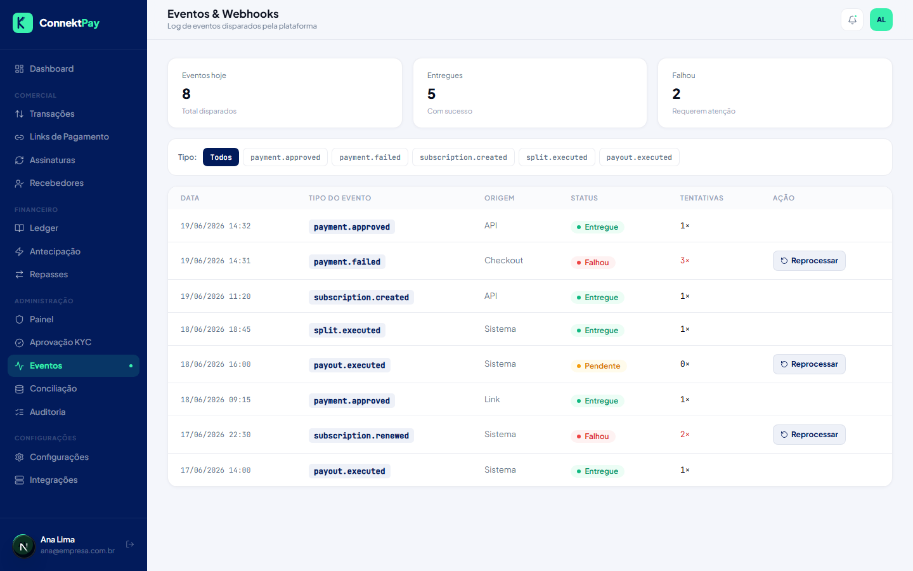
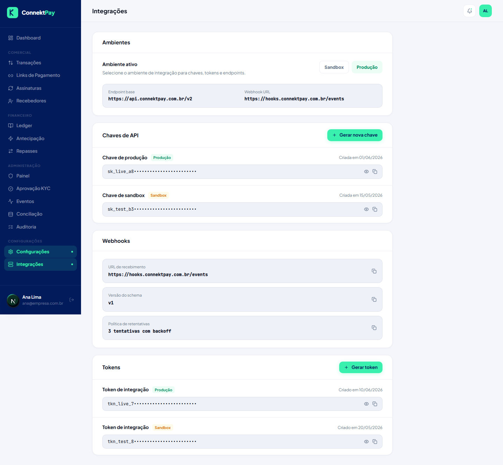
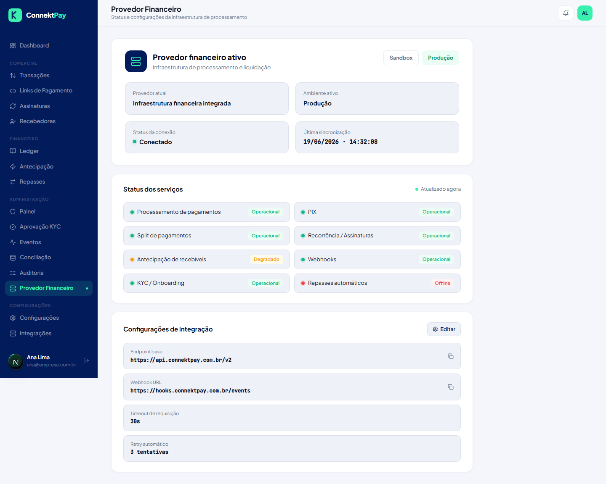

# Connekt Pay
Documento: PRD Oficial do Produto
Atualização: 19/06/2026, 15:42:11

> Este PRD descreve o comportamento final esperado do Connekt Pay, mantendo as mesmas telas já existentes no sistema. As imagens incluídas foram geradas automaticamente a partir das rotas atuais para referência visual.

## Visão Geral
O Connekt Pay é uma plataforma web de infraestrutura financeira para empresas no Brasil, reunindo operações de pagamentos, links de cobrança, recorrência, gestão de recebedores, split, ledger interno, antecipação, repasses, conciliação, webhooks, KYC, auditoria e configurações de provedor.

**Escopo documentado (existente no projeto):** Login, Cadastro, Checkout, Dashboard, Transações, Links de Pagamento, Novo Link de Pagamento, Assinaturas, Recebedores, Ledger, Antecipação, Repasses, Painel Administrativo, Aprovação KYC, Eventos, Conciliação, Auditoria, Configurações, Integrações, Provedor Financeiro.

## Arquitetura
### Next.js
- Framework: Next.js (App Router).
- Rotas: definidas em `/app` com route groups (ex.: `/app/(app)`).
- Layout autenticado: Sidebar + Header via AppShell.
- Estilos: Tailwind v4 + CSS com tokens e estilos inline predominantes.
- Build: `next build` e `next start`.

### Supabase
- Cliente configurável via variáveis `NEXT_PUBLIC_SUPABASE_URL` e `NEXT_PUBLIC_SUPABASE_ANON_KEY`.
- Hook de sessão existente para leitura de sessão e subscription de auth state change.
- Autenticação e autorização: Supabase Auth integrado ao App Router, com papéis e permissões por organização.
- Banco de dados: PostgreSQL (Supabase) com RLS para isolamento multi-tenant.
- Webhooks e eventos: persistência de eventos e tentativas para reprocessamento e observabilidade.

### PostgreSQL
- Banco relacional principal para entidades de produto (organizações, clientes, recebedores, transações, assinaturas, ledger, conciliação, KYC e auditoria).
- Modelo multi-tenant por organização, com políticas RLS e trilha de auditoria imutável.

### GitHub
- Repositório versionado (documentação assume fluxo padrão de PR + CI).
- Não há pipelines CI/CD adicionais configurados no estado atual do código.

### Vercel
- Projeto compatível com deploy na Vercel (Next.js).
- Variáveis de ambiente necessárias: `NEXT_PUBLIC_SUPABASE_URL`, `NEXT_PUBLIC_SUPABASE_ANON_KEY`.

## Arquitetura Financeira
```text
Connekt
↓
AcquirerProvider
↓
MygProvider
↓
MyGateway
↓
Pagar.me
```

Descrição:
- Connekt controla o produto e as regras.
- AcquirerProvider permite troca de provedores.
- MygProvider é a implementação atual.
- MyGateway executa a operação financeira.
- Pagar.me é a infraestrutura financeira final.

Observação: "Nenhuma tela ou regra de negócio deve acessar a MyGateway diretamente."

## Estrutura de Pastas
| Caminho | Papel |
|---|---|
| `app/` | Rotas e layouts do Next.js (App Router) |
| `components/` | UI reutilizável, layout e telas (screens) |
| `lib/` | Tokens e integrações (ex.: Supabase) |
| `hooks/` | Hooks React (ex.: sessão) |
| `services/` | Serviços de domínio (auth, pagamentos, KYC, webhooks etc.) |
| `types/` | Tipos TypeScript de domínio |
| `utils/` | Utilidades (ex.: formatação BRL) |
| `docs/` | Documentação do produto (este PRD) e imagens das telas |

## Componentes Reutilizáveis
Componentes presentes e reutilizados nas telas:
- Layout: Sidebar, Header, AppShell.
- UI: TableCard/Th/Td, Badge (status), Buttons (Primary/Ghost/Danger), Toggle, KpiCard, Avi (avatar por iniciais), WordMark/Logo.

## Fluxo de Navegação
- Entrada pública: `/login` e `/register`.
- Autenticação: login/cadastro via Supabase Auth, com criação/associação a uma organização e carregamento de permissões do usuário.
- Navegação principal: Sidebar com grupos Comercial, Financeiro, Administração e Configurações.
- Fluxos internos notáveis:
  - Dashboard → Transações (botão “Ver todas”).
  - Links de Pagamento → Novo Link → Checkout (botão “Gerar Link de Pagamento”).
  - Painel Administrativo → Aprovação KYC (botão “Ver todos” / “Revisar”).

## Papéis e Permissões
### Owner
Acesso total ao sistema.

### Admin
Gestão operacional completa.

### Financeiro
Acesso aos módulos financeiros.

### Operacional
Operações do dia a dia.

### Viewer
Somente leitura.

Observação: "As permissões são controladas por organização utilizando Supabase Auth e RLS."

## Módulos
Os módulos abaixo descrevem o comportamento final esperado do produto, mantendo as telas já existentes. Cada módulo inclui objetivo, funcionalidades, componentes, regras do produto e a imagem real da tela.

### Login
- Rota: `/login`
- Objetivo: Autenticar usuários na plataforma, garantindo acesso seguro por organização.

**Funcionalidades**
- Login por e-mail e senha com validação, mensagens de erro e controle de tentativas.
- Recuperação de senha (“Esqueci minha senha”) com envio de link por e-mail.
- Redirecionamento para o dashboard após autenticação bem-sucedida.

**Componentes presentes**
- WordMark
- Inputs (inline)
- Botões (inline)

**Regras do produto**
- A sessão é persistida e utilizada para identificar usuário e organização ativa.
- Acesso às rotas do aplicativo exige sessão válida; rotas públicas permanecem acessíveis sem sessão.

**Tela**


### Cadastro
- Rota: `/register`
- Objetivo: Cadastrar uma nova conta e criar/associar uma organização (tenant) no Connekt Pay.

**Funcionalidades**
- Cadastro com dados do usuário e identificação (CPF/CNPJ).
- Criação da organização e do perfil do usuário com papel inicial de administrador.
- Verificação de e-mail e aceite de termos de uso (quando aplicável).

**Componentes presentes**
- WordMark
- Inputs (inline)
- Botões (inline)

**Regras do produto**
- E-mail deve ser único e validado; senha deve atender requisitos mínimos de segurança.
- O cadastro inicia o processo de KYC/Onboarding da organização e/ou do recebedor principal.

**Tela**


### Checkout
- Rota: `/checkout`
- Objetivo: Permitir que o pagador finalize um pagamento com métodos PIX ou cartão, com confirmação em tempo real.

**Funcionalidades**
- Exibição do produto/serviço, valor total e condições de parcelamento (quando aplicável).
- PIX: geração de QR Code e código “copia e cola”, com expiração e atualização de status.
- Cartão: captura segura dos dados do cartão e seleção de parcelamento.
- Confirmação de pagamento e retorno para o fluxo pós-compra (ex.: página de sucesso).

**Componentes presentes**
- WordMark
- Tabs (inline)
- Inputs (inline)
- Botões (inline)

**Regras do produto**
- O método disponível (PIX/cartão) segue as configurações do link de pagamento.
- O status do pagamento é sincronizado por eventos do provedor e registrado em transactions e ledger_entries.

**Tela**


### Dashboard
- Rota: `/dashboard`
- Objetivo: Fornecer visão executiva do desempenho financeiro e operacional da organização.

**Funcionalidades**
- KPIs com recortes temporais (hoje/semana/mês/personalizado) e comparação com período anterior.
- Gráfico de volume e metas com seleção de período.
- Atividade recente com últimas transações e eventos relevantes.
- Atalhos para navegação e exploração de transações.

**Componentes presentes**
- KpiCard
- TableCard/Th/Td
- Badge
- Avi
- Recharts AreaChart

**Regras do produto**
- KPIs e gráficos são calculados a partir de transactions, ledger_entries, payouts e subscriptions.
- A visualização respeita permissões do usuário e escopo da organização (RLS).

**Tela**


### Transações
- Rota: `/transacoes`
- Objetivo: Consultar e administrar transações com busca, filtros e exportação.

**Funcionalidades**
- Busca por cliente, identificadores e referência do pagamento.
- Filtros por status e método de pagamento.
- Tabela com valores, método, status e data/hora.
- Exportação de resultados (ex.: CSV) com os filtros aplicados.

**Componentes presentes**
- TableCard/Th/Td
- Badge
- Avi

**Regras do produto**
- Status seguem o ciclo de vida do pagamento (ex.: pendente → pago/recusado/estornado).
- Exportação deve respeitar permissões e escopo da organização.

**Tela**


### Links de Pagamento
- Rota: `/links-pagamento`
- Objetivo: Gerenciar links de pagamento para cobrança avulsa e recorrente.

**Funcionalidades**
- Listagem de links com métricas (cobranças, receita acumulada, status).
- Criação de novo link e compartilhamento do URL.
- Ações por link: copiar URL, visualizar checkout e gerenciar status (ativo/inativo).

**Componentes presentes**
- PrimaryBtn
- TableCard/Th/Td
- Badge

**Regras do produto**
- Links podem ser do tipo único (pagamento avulso) ou recorrente (assinatura).
- O checkout consome as configurações do link (valor, imagem, métodos e parcelamento).

**Tela**


### Novo Link de Pagamento
- Rota: `/links-pagamento/novo`
- Objetivo: Configurar e publicar um link de pagamento com regras de cobrança e métodos.

**Funcionalidades**
- Cadastro do produto/serviço (nome, descrição, preço e imagem).
- Definição do tipo de cobrança (avulsa ou recorrente) e condições (parcelamento, periodicidade).
- Seleção de métodos habilitados (PIX e cartão) e regras de parcelamento.
- Publicação do link e redirecionamento para visualização no checkout.

**Componentes presentes**
- Toggle
- PrimaryBtn (inline via botão)
- Inputs/textarea/select (inline)

**Regras do produto**
- Parcelamento máximo define limites exibidos e aceitos no checkout.
- A publicação cria um registro em payment_links e emite eventos para rastreabilidade.

**Tela**


### Assinaturas
- Rota: `/assinaturas`
- Objetivo: Operar recorrência: planos, assinaturas, churn e ciclo de cobrança.

**Funcionalidades**
- KPIs de recorrência (MRR, assinaturas ativas, churn, próxima cobrança).
- Criação e gestão de planos (nome, preço, periodicidade e status).
- Listagem de assinaturas com status, plano, valor e próxima cobrança.
- Ações operacionais: cancelar, pausar e reativar assinaturas conforme políticas.

**Componentes presentes**
- PrimaryBtn
- TableCard/Th/Td
- Badge
- Avi

**Regras do produto**
- Cálculos de MRR e churn derivam de subscriptions e payments relacionados.
- Falhas de cobrança geram eventos e atualizam status (ex.: ativo → inadimplente → cancelado).

**Tela**


### Recebedores
- Rota: `/recebedores`
- Objetivo: Gerenciar recebedores (destinos de split e repasses) e seus dados bancários/KYC.

**Funcionalidades**
- Cadastro e edição de recebedores com documento e conta bancária.
- Visualização de saldo, volume processado e status de KYC por recebedor.
- Vinculação de recebedores às regras de split e aos repasses.

**Componentes presentes**
- PrimaryBtn
- Cards (inline)
- fmtBRL
- initials

**Regras do produto**
- Recebedores só podem receber split/repasses quando KYC estiver aprovado.
- Dados bancários devem ser validados antes de transferências bancárias.

**Tela**


### Ledger
- Rota: `/ledger`
- Objetivo: Manter um livro razão interno (ledger) para auditoria e conciliação financeira.

**Funcionalidades**
- KPIs de saldo e movimentações (créditos/débitos) por período.
- Extrato com lançamentos detalhados: tipo, origem, crédito/débito e saldo após.
- Exportação do extrato em formato compatível (ex.: OFX).

**Componentes presentes**
- TableCard/Th/Td
- fmtBRL

**Regras do produto**
- Todo evento financeiro relevante gera um ou mais lançamentos em ledger_entries.
- O saldo é a soma acumulada das entradas e saídas do ledger.
- O pay_ledger é a fonte de verdade financeira interna da Connekt.

**Tela**


### Antecipação
- Rota: `/antecipacao`
- Objetivo: Solicitar antecipação de recebíveis com simulação de taxa e acompanhamento do status.

**Funcionalidades**
- Visão de saldo disponível e valor antecipável, com taxa aplicável.
- Simulação do valor líquido antes da confirmação.
- Solicitação de antecipação e acompanhamento do histórico.

**Componentes presentes**
- KpiCard
- PrimaryBtn
- TableCard/Th/Td
- Badge

**Regras do produto**
- A elegibilidade considera recebíveis futuros, risco do recebedor e regras do provedor.
- A confirmação cria anticipation_requests e reflete no ledger quando efetivada.

**Tela**


### Repasses
- Rota: `/repasses`
- Objetivo: Gerenciar repasses (payouts) para recebedores, com agenda, status e auditoria.

**Funcionalidades**
- KPIs de volume repassado, agendados, taxa média e pendências.
- Agenda de próximos repasses e histórico completo.
- Filtros por status (ex.: agendado, processando, liquidado, falhou).
- Exportação de relatórios e conciliação de repasses.

**Componentes presentes**
- TableCard/Th/Td
- Badge
- fmtBRL

**Regras do produto**
- Repasses são disparados conforme regras (automático/manual) e disponibilidade de saldo.
- Falhas geram alertas e permitem reprocessamento controlado.

**Tela**


### Painel Administrativo
- Rota: `/admin/painel`
- Objetivo: Fornecer visão global (admin) de operação, risco e performance da plataforma.

**Funcionalidades**
- KPIs globais (TPV, usuários, recebedores, volume liquidado).
- Fila resumida de KYC pendentes e atalhos para revisão.
- Alertas do sistema (riscos, anomalias e falhas operacionais).
- Visão global das últimas transações e status.

**Componentes presentes**
- KpiCard
- TableCard/Th/Td
- Badge

**Regras do produto**
- Acesso restrito a perfis administrativos.
- Alertas e métricas derivam de eventos operacionais (webhooks, conciliação, falhas de payout e fraude).

**Tela**


### Aprovação KYC
- Rota: `/admin/aprovacao-kyc`
- Objetivo: Revisar e decidir solicitações de KYC com trilha de auditoria.

**Funcionalidades**
- Fila com empresa, documento, data de envio, risco, status e ações.
- Visualização de documentos e evidências.
- Ações de aprovação/rejeição com registro de justificativa e notificação.

**Componentes presentes**
- TableCard/Th/Td
- Badge
- DangerBtn
- GhostBtn

**Regras do produto**
- A decisão de KYC altera elegibilidade para processamento, split e repasses.
- Toda decisão gera audit_logs e webhook_events internos para rastreabilidade.

**Tela**


### Eventos
- Rota: `/admin/eventos`
- Objetivo: Monitorar eventos e webhooks da plataforma e do provedor, com reprocessamento.

**Funcionalidades**
- KPIs de volume de eventos, entregas e falhas.
- Filtro por tipo de evento (pagamento, assinatura, split, payout).
- Tabela com data, tipo, origem, status, tentativas e ação de reprocessar.

**Componentes presentes**
- TableCard/Th/Td
- Badge

**Regras do produto**
- Reprocessamento é permitido para eventos falhos, respeitando limites de tentativa e backoff.
- Cada tentativa é registrada e auditável.

**Tela**


### Conciliação
- Rota: `/admin/conciliacao`
- Objetivo: Conciliar valores internos vs provedor e tratar divergências com rastreabilidade.

**Funcionalidades**
- KPIs de transações conciliadas, divergências e valores conciliados/pendentes.
- Tabela comparativa por transação (interno vs provedor) com status.
- Exportação de relatório e evidências de conciliação.

**Componentes presentes**
- TableCard/Th/Td
- Badge
- fmtBRL

**Regras do produto**
- Conciliação gera reconciliation_batches e relaciona entradas do ledger e eventos do provedor.
- Divergências exigem revisão e ficam registradas até resolução.

**Tela**


### Auditoria
- Rota: `/admin/auditoria`
- Objetivo: Disponibilizar trilha de auditoria completa e imutável para ações críticas.

**Funcionalidades**
- Pesquisa por usuário, entidade, ação e período.
- Tabela com usuário, ação, entidade, data e diffs antes/depois.
- Exportação para auditorias externas e compliance.

**Componentes presentes**
- TableCard/Th/Td
- Search input (inline)

**Regras do produto**
- Logs são imutáveis: sem edição ou remoção por interface.
- Acesso restrito por permissão, com visibilidade por organização e/ou escopo admin.

**Tela**


### Configurações
- Rota: `/configuracoes`
- Objetivo: Gerenciar perfil, dados da empresa, segurança e notificações.

**Funcionalidades**
- Perfil do usuário: atualização de dados e preferências.
- Dados da empresa: razão social, CNPJ, segmento e site.
- Segurança: 2FA, gestão de sessões e troca de senha.
- Notificações: e-mail, SMS e webhook.

**Componentes presentes**
- PrimaryBtn
- GhostBtn
- Toggle

**Regras do produto**
- Ações sensíveis exigem confirmação, permissões e registro em audit_logs.

**Tela**


### Integrações
- Rota: `/configuracoes/integracoes`
- Objetivo: Gerenciar chaves, tokens, webhooks e ambientes de integração por organização.

**Funcionalidades**
- Ambientes: seleção entre sandbox e produção, com endpoints e webhook URL correspondentes.
- Chaves de API: criação, rotação, revogação, visualização segura e auditoria.
- Webhooks: configuração de URL, versionamento de schema e política de retentativas.
- Tokens: geração e rotação de tokens de integração, com exibição segura e cópia controlada.

**Componentes presentes**
- PrimaryBtn
- Toggle
- Cards (inline)

**Regras do produto**
- Toda alteração de chaves/tokens/webhooks é registrada em audit_logs.
- As configurações são isoladas por organization_id e ambiente.

**Tela**


### Provedor Financeiro
- Rota: `/admin/provedor-financeiro`
- Objetivo: Configurar e monitorar a integração com o provedor financeiro (ambiente, endpoints e saúde).

**Funcionalidades**
- Seleção de ambiente (sandbox/produção) e status da conexão.
- Saúde dos serviços (pagamentos, PIX, split, recorrência, antecipação, webhooks, KYC e repasses).
- Configurações: endpoints, webhook URL, timeouts, retries e credenciais.
- Ações de validação de conexão e atualização de configurações com auditoria.

**Componentes presentes**
- StatusDot
- GhostBtn
- Cards (inline)

**Regras do produto**
- Permissão de acesso restrita aos papéis Owner e Super Admin.
- Nenhuma tela ou regra de negócio acessa a MyGateway diretamente; a integração ocorre via AcquirerProvider.

**Tela**


## Banco de Dados Planejado
Modelo de dados para suportar integralmente os módulos do Connekt Pay (multi-tenant por organização) no PostgreSQL (Supabase).

### Princípios
- Multi-tenant por `organization_id` em tabelas de domínio.
- RLS (Row Level Security) para garantir isolamento de dados por organização e permissões do usuário.
- Imutabilidade/auditabilidade: eventos e logs não são reescritos; alterações sensíveis geram trilhas de auditoria.

### Tabelas (escopo)
- organizations
- profiles
- customers
- payment_links
- transactions
- subscriptions
- receivers
- split_rules
- ledger_entries
- anticipation_requests
- payouts
- webhook_events
- kyc_requests
- audit_logs
- provider_settings

### Tabelas
#### organizations
**Objetivo:** Organizações/empresas (tenant) que operam a plataforma.

**Campos principais:** `id`, `name`, `document`, `status`

**Relacionamentos**
- 1:N com profiles (profiles.organization_id).
- 1:N com customers, receivers, payment_links, transactions, subscriptions, split_rules, payouts, ledger_entries, webhook_events, kyc_requests, audit_logs, provider_settings.

| Campo | Tipo | Descrição |
|---|---|---|
| `id` | uuid | PK. Identificador da organização. |
| `name` | text | Nome/razão social (ou nome operacional). |
| `document` | text | CNPJ/CPF quando aplicável. |
| `status` | text | Status operacional (ex.: active, suspended). |
| `created_at` | timestamptz | Criação. |
| `updated_at` | timestamptz | Atualização. |

#### profiles
**Objetivo:** Perfis de usuários vinculados ao Supabase Auth, com permissões por organização.

**Campos principais:** `id`, `organization_id`, `email`, `full_name`, `role`

**Relacionamentos**
- N:1 com organizations.
- 1:N com audit_logs (audit_logs.actor_profile_id).

| Campo | Tipo | Descrição |
|---|---|---|
| `id` | uuid | PK (pode ser o mesmo do auth.users). |
| `organization_id` | uuid | FK → organizations.id |
| `email` | text | E-mail do usuário. |
| `full_name` | text | Nome completo. |
| `role` | text | Papel (ex.: admin, operator, viewer). |
| `phone` | text | Telefone. |
| `created_at` | timestamptz | Criação. |
| `updated_at` | timestamptz | Atualização. |

#### customers
**Objetivo:** Clientes finais (pagadores/assinantes) associados à organização.

**Campos principais:** `id`, `organization_id`, `name`, `email`, `document`

**Relacionamentos**
- N:1 com organizations.
- 1:N com transactions (transactions.customer_id).
- 1:N com subscriptions (subscriptions.customer_id).

| Campo | Tipo | Descrição |
|---|---|---|
| `id` | uuid | PK. |
| `organization_id` | uuid | FK → organizations.id |
| `name` | text | Nome do cliente. |
| `email` | text | E-mail do cliente. |
| `document` | text | CPF/CNPJ. |
| `phone` | text | Telefone. |
| `created_at` | timestamptz | Criação. |
| `updated_at` | timestamptz | Atualização. |

#### receivers
**Objetivo:** Recebedores (destinos de split e repasses) com dados bancários e status KYC.

**Campos principais:** `id`, `organization_id`, `name`, `document`, `bank_account`, `kyc_status`, `status`

**Relacionamentos**
- N:1 com organizations.
- 1:N com split_rules (split_rules.receiver_id).
- 1:N com payouts (payouts.receiver_id).
- 1:N com anticipation_requests (anticipation_requests.receiver_id).
- Pode se relacionar a kyc_requests (kyc_requests.receiver_id).

| Campo | Tipo | Descrição |
|---|---|---|
| `id` | uuid | PK. |
| `organization_id` | uuid | FK → organizations.id |
| `name` | text | Nome/razão social. |
| `document` | text | CPF/CNPJ. |
| `bank_account` | jsonb | Dados bancários normalizados (banco/agência/conta/tipo). |
| `kyc_status` | text | Status KYC (ex.: pending, in_review, approved, rejected). |
| `status` | text | Status do recebedor (ex.: active, disabled). |
| `created_at` | timestamptz | Criação. |
| `updated_at` | timestamptz | Atualização. |

#### payment_links
**Objetivo:** Links de pagamento (avulso/recorrente) com produto, preço e configurações.

**Campos principais:** `id`, `organization_id`, `name`, `amount`, `type`, `methods`, `status`, `slug`

**Relacionamentos**
- N:1 com organizations.
- 1:N com transactions (transactions.payment_link_id).
- 1:N com subscriptions (subscriptions.payment_link_id).
- 1:N com split_rules (split_rules.payment_link_id).

| Campo | Tipo | Descrição |
|---|---|---|
| `id` | uuid | PK. |
| `organization_id` | uuid | FK → organizations.id |
| `name` | text | Nome do produto. |
| `description` | text | Descrição do produto. |
| `amount` | bigint | Valor em centavos. |
| `type` | text | one_time | recurring. |
| `methods` | jsonb | Métodos habilitados (pix/card) e regras. |
| `max_installments` | int | Parcelamento máximo. |
| `status` | text | active | inactive. |
| `slug` | text | Identificador público do link. |
| `created_at` | timestamptz | Criação. |
| `updated_at` | timestamptz | Atualização. |

#### transactions
**Objetivo:** Transações de pagamento com status, método, valores e referências do provedor.

**Campos principais:** `id`, `organization_id`, `amount`, `method`, `status`, `provider_reference`, `created_at`

**Relacionamentos**
- N:1 com organizations.
- N:1 com customers (opcional).
- N:1 com payment_links (opcional).
- 1:N com ledger_entries (ledger_entries.transaction_id).

| Campo | Tipo | Descrição |
|---|---|---|
| `id` | uuid | PK. |
| `organization_id` | uuid | FK → organizations.id |
| `customer_id` | uuid | FK → customers.id (quando aplicável). |
| `payment_link_id` | uuid | FK → payment_links.id (quando originada por link). |
| `amount` | bigint | Valor bruto em centavos. |
| `currency` | text | Moeda (BRL). |
| `method` | text | pix | card (e extensões futuras). |
| `status` | text | pending | paid | refused | refunded | chargeback. |
| `provider_reference` | text | Identificador do provedor. |
| `provider_payload` | jsonb | Dados relevantes do provedor (normalizados). |
| `created_at` | timestamptz | Criação. |
| `updated_at` | timestamptz | Atualização. |

#### subscriptions
**Objetivo:** Assinaturas e seu ciclo: status, próxima cobrança, plano e valores.

**Campos principais:** `id`, `organization_id`, `customer_id`, `amount`, `interval`, `status`, `next_billing_at`

**Relacionamentos**
- N:1 com organizations.
- N:1 com customers.
- N:1 com payment_links (opcional).
- Pode gerar transactions e webhook_events ao longo do ciclo de cobrança.

| Campo | Tipo | Descrição |
|---|---|---|
| `id` | uuid | PK. |
| `organization_id` | uuid | FK → organizations.id |
| `customer_id` | uuid | FK → customers.id |
| `payment_link_id` | uuid | FK → payment_links.id (quando link recorrente). |
| `amount` | bigint | Valor recorrente em centavos. |
| `interval` | text | monthly | yearly (ou equivalente). |
| `status` | text | active | past_due | canceled | paused. |
| `next_billing_at` | timestamptz | Próxima cobrança. |
| `provider_reference` | text | Identificador do provedor. |
| `created_at` | timestamptz | Criação. |
| `updated_at` | timestamptz | Atualização. |

#### split_rules
**Objetivo:** Regras de split por organização/link/transação, distribuindo valores para recebedores.

**Campos principais:** `id`, `organization_id`, `receiver_id`, `payment_link_id`, `type`, `value`, `priority`, `status`

**Relacionamentos**
- N:1 com organizations.
- N:1 com receivers.
- N:1 com payment_links (opcional).
- Aplicadas no split lógico do produto e reconciliadas com split financeiro do provedor.

| Campo | Tipo | Descrição |
|---|---|---|
| `id` | uuid | PK. |
| `organization_id` | uuid | FK → organizations.id |
| `receiver_id` | uuid | FK → receivers.id |
| `payment_link_id` | uuid | FK → payment_links.id (opcional). |
| `type` | text | percentage | fixed. |
| `value` | numeric | Percentual (0–100) ou valor fixo em centavos. |
| `priority` | int | Ordem de aplicação. |
| `status` | text | active | inactive. |
| `created_at` | timestamptz | Criação. |
| `updated_at` | timestamptz | Atualização. |

#### anticipation_requests
**Objetivo:** Solicitações de antecipação com simulação, taxa e status.

**Campos principais:** `id`, `organization_id`, `requested_amount`, `fee_rate`, `fee_amount`, `net_amount`, `status`, `provider_reference`

**Relacionamentos**
- N:1 com organizations.
- N:1 com receivers (opcional).
- 1:N com ledger_entries (ledger_entries.anticipation_request_id).

| Campo | Tipo | Descrição |
|---|---|---|
| `id` | uuid | PK. |
| `organization_id` | uuid | FK → organizations.id |
| `receiver_id` | uuid | FK → receivers.id (quando aplicável). |
| `requested_amount` | bigint | Valor solicitado em centavos. |
| `fee_rate` | numeric | Taxa aplicada (ex.: ao mês). |
| `fee_amount` | bigint | Valor da taxa em centavos. |
| `net_amount` | bigint | Valor líquido em centavos. |
| `status` | text | requested | approved | rejected | paid_out. |
| `provider_reference` | text | Identificador do provedor. |
| `created_at` | timestamptz | Criação. |
| `updated_at` | timestamptz | Atualização. |

#### payouts
**Objetivo:** Repasses/transferências bancárias (payouts) com status e valores.

**Campos principais:** `id`, `organization_id`, `receiver_id`, `gross_amount`, `fee_amount`, `net_amount`, `status`, `scheduled_for`

**Relacionamentos**
- N:1 com organizations.
- N:1 com receivers.
- 1:N com ledger_entries (ledger_entries.payout_id).

| Campo | Tipo | Descrição |
|---|---|---|
| `id` | uuid | PK. |
| `organization_id` | uuid | FK → organizations.id |
| `receiver_id` | uuid | FK → receivers.id |
| `gross_amount` | bigint | Valor bruto em centavos. |
| `fee_amount` | bigint | Taxas em centavos. |
| `net_amount` | bigint | Valor líquido em centavos. |
| `status` | text | scheduled | processing | settled | failed. |
| `scheduled_for` | timestamptz | Data/hora programada. |
| `provider_reference` | text | Identificador do provedor. |
| `created_at` | timestamptz | Criação. |
| `updated_at` | timestamptz | Atualização. |

#### ledger_entries
**Objetivo:** Lançamentos do ledger interno, com saldo acumulado e origem do evento.

**Campos principais:** `id`, `organization_id`, `type`, `direction`, `amount`, `balance_after`, `occurred_at`, `origin`

**Relacionamentos**
- N:1 com organizations.
- N:1 com transactions (opcional).
- N:1 com payouts (opcional).
- N:1 com anticipation_requests (opcional).
- Fonte de verdade do pay_ledger (consolidação/visões).

| Campo | Tipo | Descrição |
|---|---|---|
| `id` | uuid | PK. |
| `organization_id` | uuid | FK → organizations.id |
| `transaction_id` | uuid | FK → transactions.id (opcional). |
| `payout_id` | uuid | FK → payouts.id (opcional). |
| `anticipation_request_id` | uuid | FK → anticipation_requests.id (opcional). |
| `type` | text | Tipo do lançamento (sale, fee, split, payout, reversal etc.). |
| `direction` | text | credit | debit. |
| `amount` | bigint | Valor em centavos. |
| `balance_after` | bigint | Saldo após o lançamento, em centavos. |
| `origin` | text | Origem (ex.: API, webhook, admin). |
| `occurred_at` | timestamptz | Data/hora do evento. |
| `created_at` | timestamptz | Criação. |

#### reconciliation_batches
**Objetivo:** Lotes de conciliação com resultados e evidências.

**Campos principais:** `id`, `organization_id`, `period_start`, `period_end`, `status`

**Relacionamentos**
- N:1 com organizations.
- Relaciona divergências a transactions/ledger_entries e evidências do provedor por referência.

| Campo | Tipo | Descrição |
|---|---|---|
| `id` | uuid | PK. |
| `organization_id` | uuid | FK → organizations.id |
| `period_start` | date | Início do período. |
| `period_end` | date | Fim do período. |
| `status` | text | open | reviewed | closed. |
| `summary` | jsonb | Resumo (conciliadas, divergências, valores). |
| `created_at` | timestamptz | Criação. |
| `updated_at` | timestamptz | Atualização. |

#### webhook_events
**Objetivo:** Eventos recebidos/enviados e tentativas (para reprocessamento e observabilidade).

**Campos principais:** `id`, `organization_id`, `type`, `origin`, `status`, `attempts`, `created_at`

**Relacionamentos**
- N:1 com organizations.
- Pode referenciar entities internas por payload (transactions/subscriptions/payouts/etc.).
- Tentativas e erros são auditáveis e suportam reprocessamento.

| Campo | Tipo | Descrição |
|---|---|---|
| `id` | uuid | PK. |
| `organization_id` | uuid | FK → organizations.id |
| `type` | text | Tipo do evento (ex.: payment.approved). |
| `origin` | text | Origem (provider/internal). |
| `status` | text | delivered | failed | pending. |
| `attempts` | int | Número de tentativas. |
| `payload` | jsonb | Payload do evento. |
| `last_error` | text | Último erro (se houver). |
| `created_at` | timestamptz | Criação. |
| `updated_at` | timestamptz | Atualização. |

#### kyc_requests
**Objetivo:** Solicitações de KYC com status, risco, evidências e decisões.

**Campos principais:** `id`, `organization_id`, `receiver_id`, `status`, `risk`, `submitted_at`, `reviewed_at`

**Relacionamentos**
- N:1 com organizations.
- N:1 com receivers (opcional).
- Gera audit_logs e pode gerar webhook_events internos.

| Campo | Tipo | Descrição |
|---|---|---|
| `id` | uuid | PK. |
| `organization_id` | uuid | FK → organizations.id |
| `receiver_id` | uuid | FK → receivers.id (opcional). |
| `status` | text | pending | in_review | approved | rejected. |
| `risk` | text | low | medium | high. |
| `submitted_at` | timestamptz | Data/hora de submissão. |
| `reviewed_at` | timestamptz | Data/hora de decisão. |
| `decision_reason` | text | Justificativa da decisão. |
| `evidence` | jsonb | Metadados/links para evidências. |
| `created_at` | timestamptz | Criação. |
| `updated_at` | timestamptz | Atualização. |

#### audit_logs
**Objetivo:** Logs de auditoria imutáveis para ações críticas, com diffs antes/depois.

**Campos principais:** `id`, `organization_id`, `actor_profile_id`, `action`, `entity`, `entity_id`, `created_at`

**Relacionamentos**
- N:1 com organizations.
- N:1 com profiles (ator).
- Relaciona-se a qualquer entidade via entity/entity_id e diffs before/after.

| Campo | Tipo | Descrição |
|---|---|---|
| `id` | uuid | PK. |
| `organization_id` | uuid | FK → organizations.id |
| `actor_profile_id` | uuid | FK → profiles.id |
| `action` | text | CREATE | UPDATE | DELETE | AUTO_CHARGE etc. |
| `entity` | text | Entidade afetada (ex.: receiver, payout). |
| `entity_id` | uuid | ID do registro afetado (quando aplicável). |
| `before` | jsonb | Estado anterior (quando aplicável). |
| `after` | jsonb | Estado posterior (quando aplicável). |
| `created_at` | timestamptz | Criação. |

#### provider_settings
**Objetivo:** Configurações de integração com provedor financeiro por organização/ambiente.

**Campos principais:** `id`, `organization_id`, `environment`, `base_url`, `webhook_url`, `timeout_seconds`, `status`, `last_sync_at`

**Relacionamentos**
- N:1 com organizations.
- Define parâmetros operacionais usados por AcquirerProvider/MygProvider (sem acoplamento direto com MyGateway na UI).

| Campo | Tipo | Descrição |
|---|---|---|
| `id` | uuid | PK. |
| `organization_id` | uuid | FK → organizations.id |
| `environment` | text | sandbox | production. |
| `base_url` | text | Endpoint base do provedor. |
| `webhook_url` | text | URL de webhook configurada. |
| `timeout_seconds` | int | Timeout de requisição. |
| `retry_policy` | jsonb | Política de retentativas. |
| `status` | text | connected | degraded | offline. |
| `last_sync_at` | timestamptz | Última sincronização. |
| `created_at` | timestamptz | Criação. |
| `updated_at` | timestamptz | Atualização. |

## Responsabilidades do Connekt Pay
Responsabilidades da plataforma Connekt Pay (produto):
- Gestão dos clientes.
- Gestão dos recebedores.
- Regras de split.
- Recorrência.
- Links de pagamento.
- Ledger interno.
- Conciliação.
- Webhooks.
- KYC.
- Auditoria.
- Repasses.
- Antecipações.
- Dashboard.
- Autenticação.
- Permissões.
- Configurações do provedor.

## Responsabilidades do Provedor Financeiro
Responsabilidades do provedor financeiro (infraestrutura):
- Processamento financeiro.
- Captura.
- Liquidação.
- Transferências bancárias.
- Split financeiro real.
- Recorrência financeira real.
- Antecipação financeira real.

## Responsabilidades da Connekt
- Dashboard;
- Usuários;
- Empresas;
- Recebedores;
- KYC;
- Produtos;
- Checkout;
- Links de pagamento;
- Transações internas;
- Split lógico;
- Ledger;
- Recorrência;
- Antecipação;
- Repasses;
- Conciliação;
- Relatórios;
- Auditoria;
- Notificações;
- Multi-adquirente;
- AcquirerProvider;
- Regras de negócio.

## Responsabilidades da MyGateway
- Pix;
- Cartão;
- Tokenização;
- Split financeiro;
- Recorrência financeira;
- Pix Automático;
- Liquidação;
- Repasses bancários;
- Antecipação financeira;
- PCI;
- Eventos financeiros.

Observação: "A MyGateway pode ser substituída futuramente sem alterar o produto."

## API Pública
**Objetivo:**
Permitir integrações externas com ERP, LMS, CRMs e sistemas parceiros.

**Autenticação:**
- API Key;
- Escopo por organização;
- Rate limit.

**Endpoints previstos:**
- POST /api/payments
- GET /api/transactions
- POST /api/payment-links
- GET /api/payment-links
- POST /api/subscriptions
- GET /api/subscriptions
- POST /api/receivers
- GET /api/receivers
- POST /api/payouts
- GET /api/ledger
- POST /api/webhooks
- GET /api/customers
- POST /api/customers

Observação: "Toda API respeita o isolamento por organization_id."

## Eventos Disponíveis
- payment.created
- payment.pending
- payment.paid
- payment.failed
- payment.refunded
- subscription.created
- subscription.renewed
- subscription.canceled
- receiver.created
- receiver.updated
- payout.created
- payout.completed
- anticipation.requested
- anticipation.completed
- kyc.approved
- kyc.rejected
- split.executed

---
Leonardo Noronha
